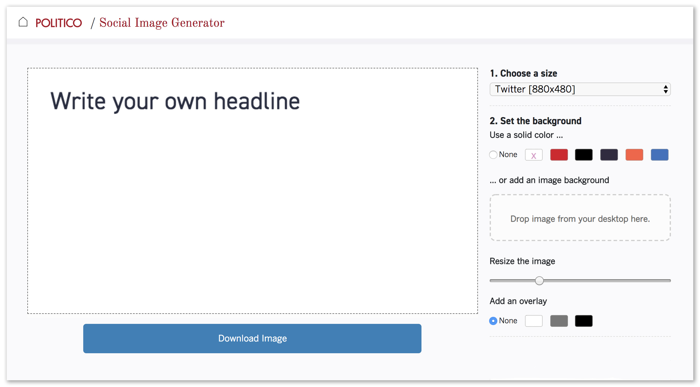

# Meme (POLITICO remix)

Meme is a generator that Vox Media uses to create social sharing images. See working version at [http://www.sbnation.com/a/meme](http://www.sbnation.com/a/meme).

This is the POLITICO fork of the Los Angeles Times Data Desk's fork.

Here is what they added:

- Options to change the image's aspect ratio
- Options to set a solid background color
- Linebreaks allowed in the headlines
- Deployment script to build static site inside newsroom VPN

Here is what we added:
- POLITICO fonts
- POLITICO watermarks



How to deploy
-------------------------------

**Edit the ``source`` directory to make the changes you want**

You can fire up the test server locally by running:

```bash
$ make serve
```

**Build the source files into a working static site**

Like so:

```bash
$ make build
```

Because we don't have a unique domain name for this project, you'll need to go into the built files and change the following paths by adding a `./` to the start.
- index.html
  - `./stylesheets/main-SOME-HASH.css`
  - `./javascripts/application-SOME-HASH.js`
  - `./javascripts/settings-SOME-HASH.js`

- settings-SOME-HASH.js
  - All `/images/...` to `./images/...`


**Commit your work**

Use Git to commit your work to our repository.

```bash
# Add the changes
$ git add .
# Log your work
$ git commit -m "A precise message goes here"
# Push it up to GitHub
$ git push origin master
```

**Deploy your changes to Amazon S3**

```bash
$ make ship
```
